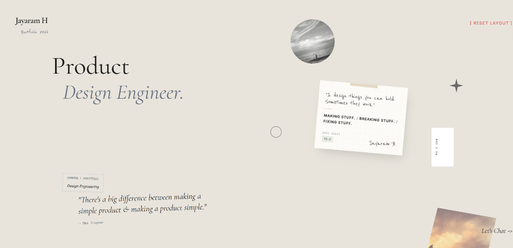

<div align="center">
  
</div>

# Jayaram H | Product Design Engineer

Portfolio 2026. "There's a big difference between making a simple product & making a product simple." — Des Traynor

## 🚀 Overview

This repository contains my personal portfolio website, designed and built to showcase my work as a Product Design Engineer. It focuses on clean aesthetics, smooth interactions, and a premium user experience.

## 🛠️ Tech Stack

- **Framework**: Vite + React
- **Styling**: Vanilla CSS / Tailwind CSS
- **Intelligence**: Built with AI Studio & AntiGravity

## 💻 Running Locally

**Prerequisites:** Node.js

1.  **Clone the repository**
2.  **Install dependencies**:
    ```bash
    npm install
    ```
3.  **Set up environment**:
    Create a `.env.local` file and add your Gemini API key:
    ```env
    VITE_GEMINI_API_KEY=your_api_key_here
    ```
4.  **Run the app**:
    ```bash
    npm run dev
    ```

---

<div align="center">
  MAKING STUFF. / BREAKING STUFF. / FIXING STUFF.
</div>
